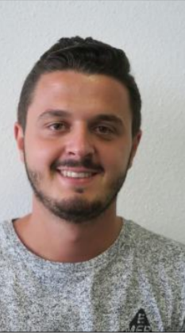
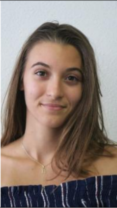
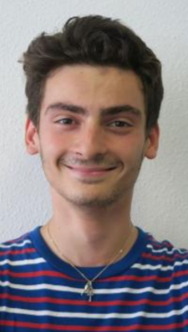

<head>
  <meta charset="utf-8" />
  <title>Nous connaître</title>
  
  

</head>

## Qui sommes nous ?
Actuellement en 2ème année d'école d'ingénieur en systèmes embraqués et communicants, à **l'ISEN de Toulon** et en apprentissage avec **l'ITII**. Nous avons réalisé le projet RéponsAtout afin de mettre en pratique les cours de système d'exploitation. 

## Nos profils

  

  

  

