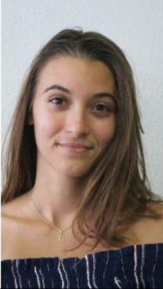

<head>
  <meta charset="utf-8" />
  <title>Nous connaître</title>
  
  

</head>

## Qui sommes nous ?
Actuellement en 2ème année d'école d'ingénieur en systèmes embraqués et communicants, à **l'ISEN de Toulon** et en apprentissage avec **l'ITII**. Nous avons réalisé le projet RéponsAtout afin de mettre en pratique les cours de système d'exploitation. 

## Nos profils

  

Matteo est le chef du projet, il communique avec nos cliets afin de comprendre leurs besoins

  

Eva est notre commerciale, elle gère le site internet ainsi que la vente du produit

  

Alexis gère le programme et le design de notre produit, il réalise vos demandes les plus folles
                            

<button class="button button1" onclick="window.location.href = 'https://eva-joly.github.io/ReponsAtout/';">Home</button>
<button class="button button2" style="float:right" onclick="window.location.href = 'https://eva-joly.github.io/ReponsAtout/assets/pages/02_le_projet';">Le projet</button>
