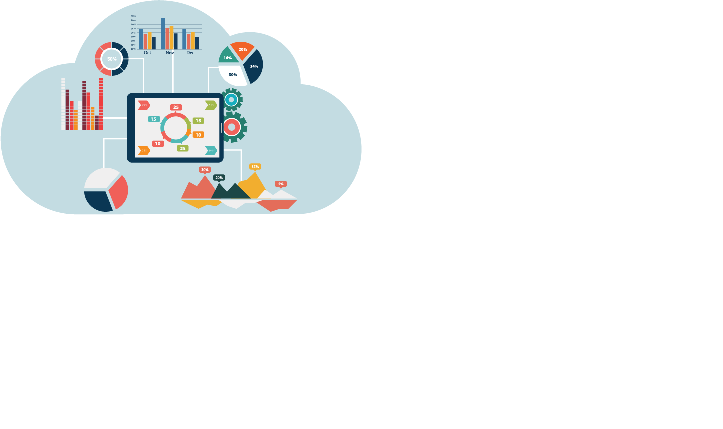

# Bienvenue sur notre site !

ReponsATout est un projet réalisé par notre équipe. Elle se compose de trois ingénieur passionés dans leur travail, vous pouvez trouver sur ce site l'avancé de leurs travaux.

{:align=center}

<nav>
  <ul>
    <li>
      L'équipe
      
    </li>
  </ul>
</nav>
nav ul {
    list-style-type: none;
    margin: 0;
    padding: 0;
}

nav ul li {
    --c: goldenrod;
    color: blue;
    font-size: 16px;
    border: 0.3em solid blue;
    border-radius: 0.5em;
    width: 12em;
    height: 3em;
    text-transform: uppercase;
    font-weight: bold;
    font-family: sans-serif;
    letter-spacing: 0.1em;
    text-align: center;
    line-height: 3em;
    position: relative;
    overflow: hidden;
    z-index: 1;
    transition: 0.5s;
    margin: 1em;
}

nav ul li span {
    position: absolute;
    width: 25%;
    height: 100%;
    background-color: blue;
    transform: translateY(150%);
    border-radius: 50%;
    left: calc((var(--n) - 1) * 25%);
    transition: 0.5s;
    transition-delay: calc((var(--n) - 1) * 0.1s);
    z-index: -1;
}

nav ul li:hover {
    color: black;
}

nav ul li:hover span {
    transform: translateY(0) scale(2);
}

nav ul li span:nth-child(1) {
    --n: 1;
}

nav ul li span:nth-child(2) {
    --n: 2;
}

nav ul li span:nth-child(3) {
    --n: 3;
}

nav ul li span:nth-child(4) {
    --n: 4;
}
